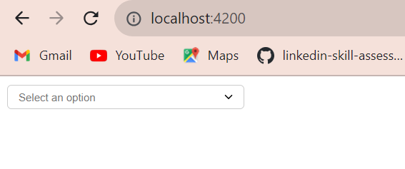
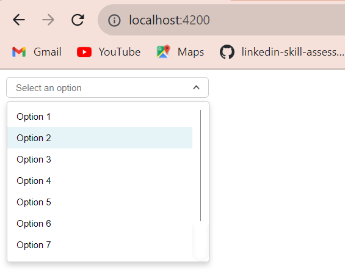
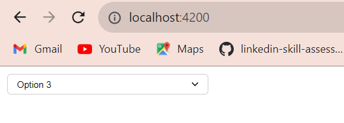
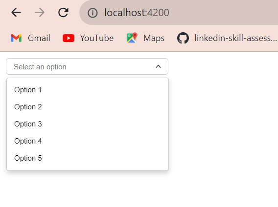

# STEPS TO RUN :

1) install node@18.17.1 and angular-cli@16.2.0 . 
2) run : ```npm install```
3) run : ```npm run build```
4) run : ```npm start```

# Details :
1) Created a custom dropdown component as per the design using basic of html div and list.
2) Added data bindings and class binding for implementation of dropdown functionality and communication between view and component.
3) Added custom css animations to the options .
4) Added dynamic height changes to the option panel
   i.e More than 7 items in the list then scrollbar will display and if there is less than or equal to 7 items then option panel height will change based upon the number of items.
5) A default option to revert back to "Select an option" state is not added because it was not there in the design specified. But we can do that for implementing set to Default.

# Result :
1) Fig 1: Default State of Dropdown when nothing is selected.

2) Fig 2: When we open the options panel.

3) Fig 3: When we select an option from the list.

4) Fig 4: When we have less tha 7 items in the option list.

